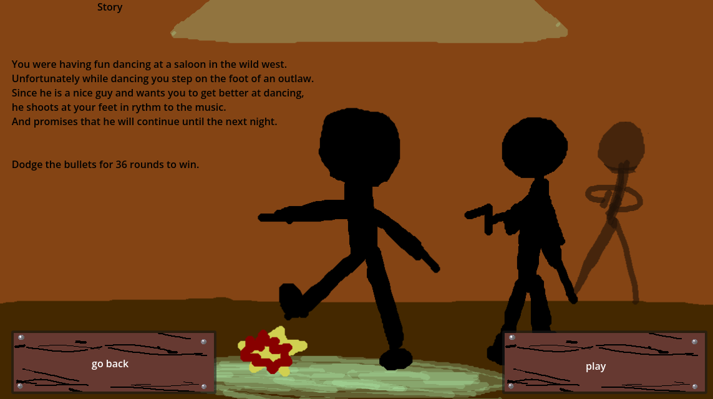
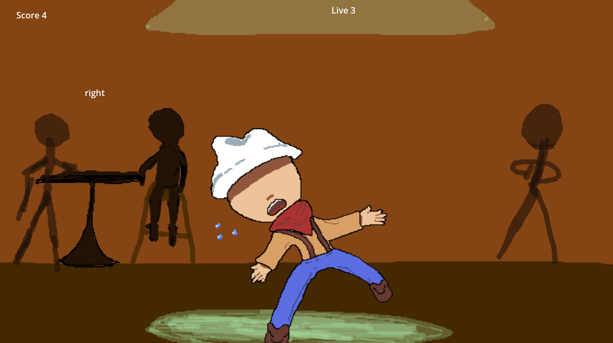

# 👢 Dancing in the Wild West

## Description
**Dancing in the Wild West** is a fast‑paced 2D rhythm game developed with **Godot**.  
You play as a cowboy who accidentally angered a notorious outlaw — and now you have to dodge all **36 bullets** he fires at you.

## Gameplay
The game features one stage, but the rhythm and speed of the bullets increase over time.  
Your goal is simple: **survive the entire sequence without getting hit**.

  

## Controls
- **Move left/right:** A / D

## Objective
- **Dodge all 36 bullets** to survive the outlaw’s attack.
